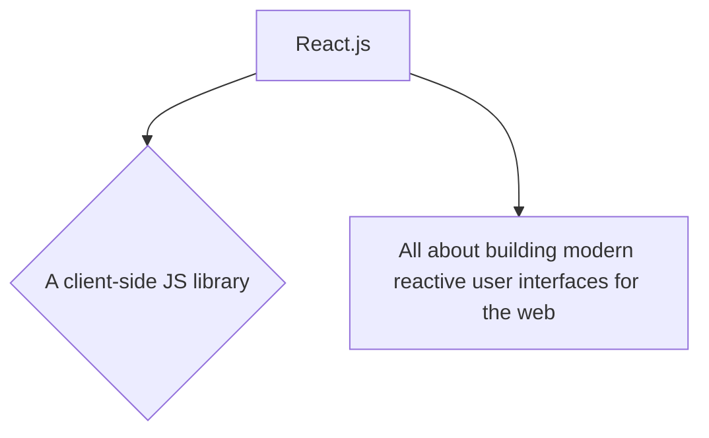

# EX. 1

## Write a JavaScript function that returns a passed string with letters in alphabetical order.

### Example string : 'webmaster' Expected Output : 'abeemrstw', Example string : '31412' Expected Output : '11234'

======

# EX. 2

## Write a JavaScript function which accepts an argument and returns the type.

### There are six possible values that typeof returns: object, boolean, function, number, string, and undefined.

======

# EX. 3

## Write a JavaScript function which will take an array of numbers stored and find the second lowest and second greatest numbers, respectively.

### Sample array : [1,2,3,4,5] Expected Output : 2,4 

======

# EX. 4

## Write a JavaScript function which says whether a number is perfect.

[Perfect Number Wiki](https://en.wikipedia.org/wiki/Perfect_number)

======

# EX. 5

##  Write a JavaScript function to compute the factors of a positive integer.

======

# EX. 6

## Write a JavaScript function to convert an amount to coins.

### Sample function : amountTocoins(46, [25, 10, 5, 2, 1]) Here 46 is the amount. and 25, 10, 5, 2, 1 are coins. Output : 25, 10, 10, 1

======

# EX. 7

## Write a JavaScript function to extract unique characters from a string.

### Example string : "thequickbrownfoxjumpsoverthelazydog" Expected Output : "thequickbrownfxjmpsvlazydg"

======

# EX. 8

## Write a JavaScript function to get the number of occurrences of each letter in specified string. 

### Example string : "Hello World" Expected Output : { H: 1, e: 1, l: 3, o: 2, W: 1, r: 1, d: 1 }

======

# EX. 9

## Write a JavaScript function that generates a string id (specified length) of random characters.

### Sample character list : "ABCDEFGHIJKLMNOPQRSTUVWXYZabcdefghijklmnopqrstuvwxyz0123456789"

======

# EX. 10

## Write a JavaScript function to find the first not repeated character.

### Sample arguments : 'abacddbec' Expected output : 'e' 

======

# EX. 11

## Write a JavaScript function to find longest substring in a given string without repeating characters.

======

# EX. 12

## Write a JavaScript function that returns the longest palindrome in a given string.

======

# EX. 13

## Write a JavaScript function to get the function name when called.

### Example: abc(); Output: abc

======
